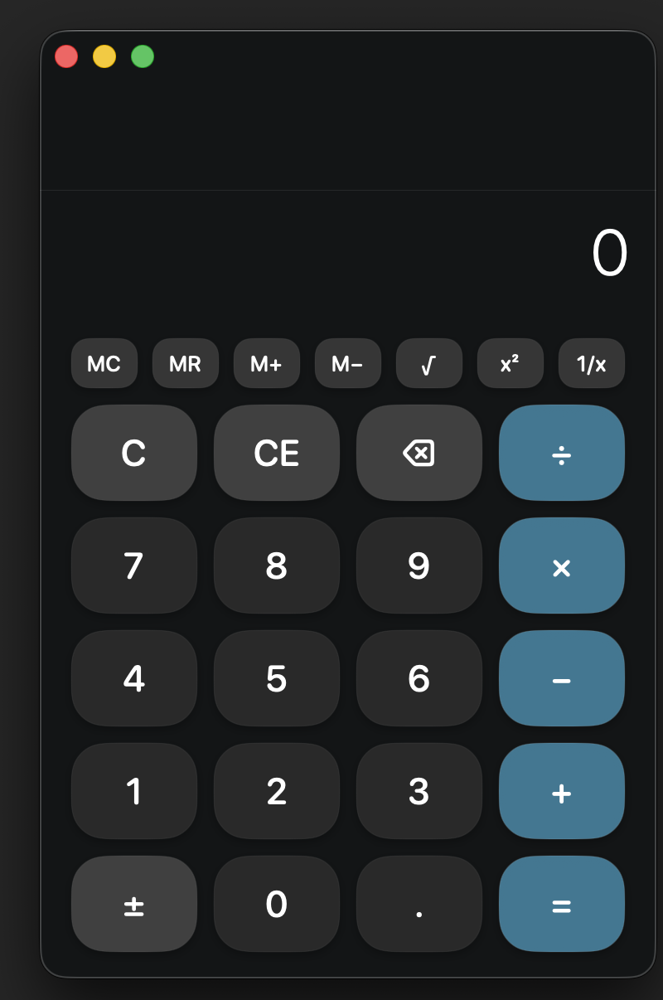
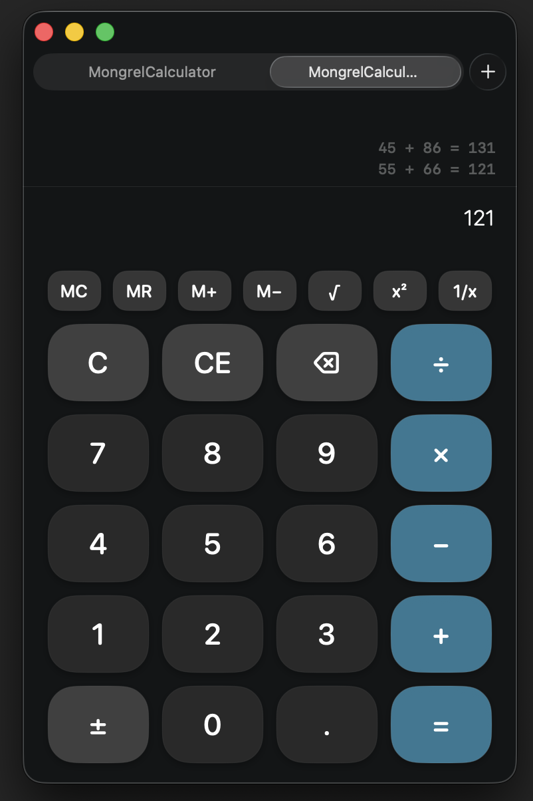

# Mongrel Calculator

A compact, native macOS calculator with an independent session in every window or tab. Version 0.9.1 is a direct-distribution beta: deliberately small, offline, and built around predictable keyboard operation rather than App Store machinery.

## Current Interface

| Calculator | Independent native tabs |
|---|---|
|  |  |

The screenshots predate the beta history popover and accessibility appearance controls.

## Features

- Standard arithmetic, chained operations, operator replacement, repeated equals, and context-aware percentages.
- Square root, square, reciprocal, backspace, sign toggle, and MC/MR/M+/M- memory controls.
- Live expression readout and a scrollable 30-entry calculation history.
- One-key input for digits and operators; Return calculates, Escape clears the entry, X or asterisk multiplies, and slash divides.
- Native Command-C result copying and Command-V numeric paste, including decimal comma and scientific notation.
- Independent state for every native macOS window and tab.
- Default exact-black 21:1 Contrast, original Classic, and persistent Custom background/text appearance modes.
- Live contrast measurement, readable-settings recovery, and one-click repair for low-contrast custom colors.
- VoiceOver names, keyboard help, and Reduce Motion support.
- No account, network access, analytics, advertising, or telemetry. See [PRIVACY.md](PRIVACY.md).

## Reliability

The calculation engine treats invalid operations as explicit recoverable states. Division by zero, negative square roots, overflow, malformed pasted values, and non-finite memory operations cannot leak partial state into the next calculation. Very small finite results use scientific notation rather than rounding to zero.

The automated suite currently contains 34 regression tests covering arithmetic, percentages, repeated operations, state recovery, precision, overflow, locale-aware paste handling, memory, history limits, tab isolation, keyboard shortcut routing, appearance persistence, and contrast guarantees.

## Requirements

- macOS 14 or newer
- Xcode 15 or newer
- [XcodeGen](https://github.com/yonaskolb/XcodeGen)

## Build and Test

```bash
cd MongrelCalculator
xcodegen generate
xcodebuild -project MongrelCalculator.xcodeproj \
  -scheme MongrelCalculator \
  -destination 'platform=macOS' test
```

## Build a Beta Zip

```bash
./scripts/build-beta.sh
```

The script produces a universal app archive and SHA-256 checksum in the dist directory. Without credentials it creates an unsigned local-testing build.

```bash
DEVELOPER_ID_APPLICATION="Developer ID Application: …" \
NOTARYTOOL_PROFILE="stored-profile-name" \
./scripts/build-beta.sh
```

Providing only DEVELOPER_ID_APPLICATION creates a signed but unnotarized build. Providing both variables submits the build with a stored notarytool profile, waits for acceptance, staples the ticket, and packages the public beta. The repository contains no signing credentials.

Use [docs/BETA_TEST_CHECKLIST.md](docs/BETA_TEST_CHECKLIST.md) for release-candidate checks and [CHANGELOG.md](CHANGELOG.md) for beta changes.

## Project Layout

```text
MongrelCalculator/
├── project.yml
├── Tests/
└── MongrelCalculator/
    ├── App/
    ├── Engine/
    ├── Theme/
    └── Views/
docs/
scripts/
```

The Xcode project is generated from project.yml; generated user state and build artifacts are ignored.

## Source Status

The source is visible during active development, but a formal open-source license has not been selected. No reuse license is granted yet.
